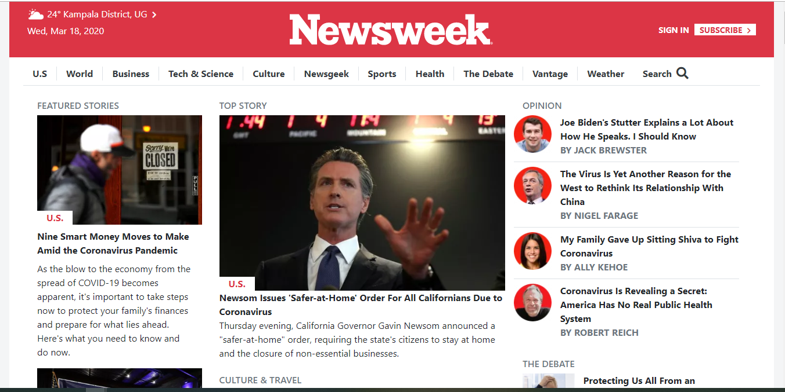

# Newsweek.com home page clone with Bootstrap [Solo project]

> This project consists of building an HTML document that matches the Appearance of the Newsweek.com home page

The purpose of this project is to clone the appearance of Newsweek.com home page using bootstrap.

## Built With

- HTML,
- CSS,
-BOOTSTRAP

## Live Demo

[Live Demo Link](https://raw.githack.com/OdongAlican/newsweek.com-home-page/develop/)

## Getting Started

To get a local copy up and running follow these simple example steps.

### Prerequisites

#### You should have installed git on your local machine and a text editor.

### Setup

#### Clone the repository into your local machine.

## Author

👤 **Author**

- Github: [@OdongAlican](https://github.com/OdongAlican)
- Twitter: [@odongsandie](https://twitter.com/odongsandie)
- Linkedin: [Sunday Alican odong](https://www.linkedin.com/in/sunday-alican-odong-b99226b7)

Contributions, issues and feature requests are welcome!

Feel free to check the [issues page](issues/).

## Show your support

Give a ⭐️ if you like this project!

## Acknowledgments

- Appreciation to my coding Partner and mentor

## 📝 License

This project is [MIT](lic.url) licensed.
